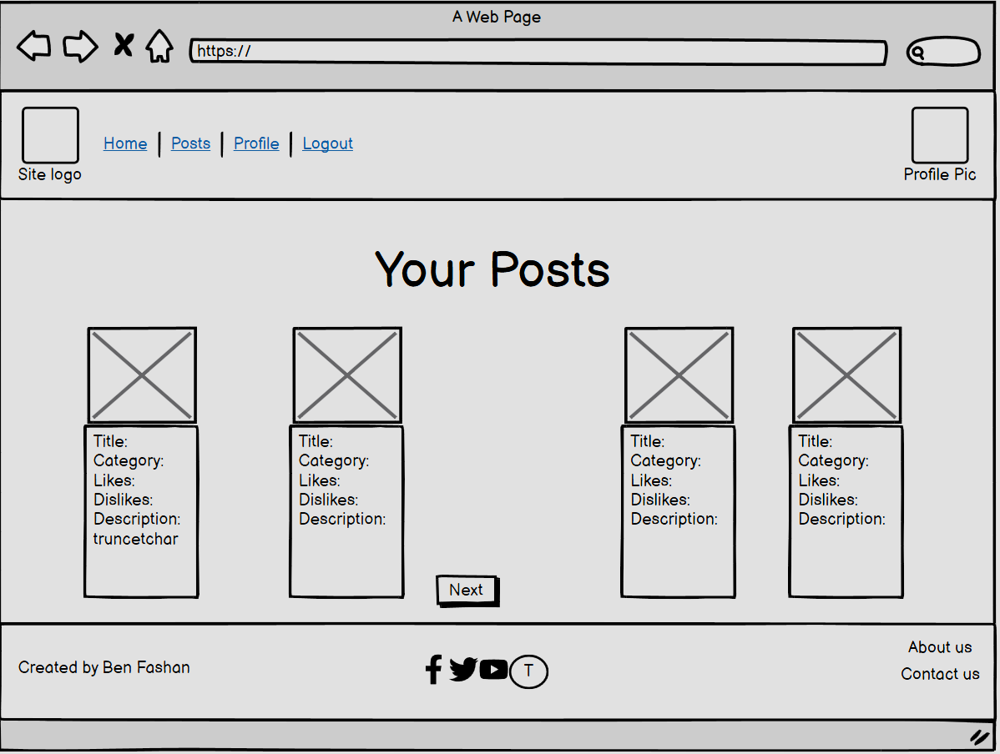
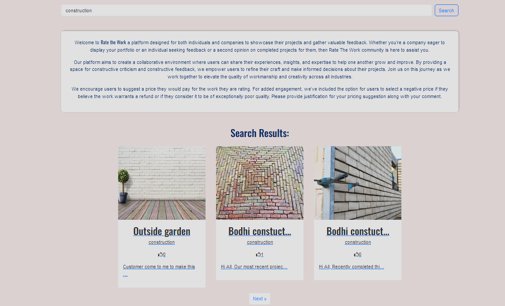
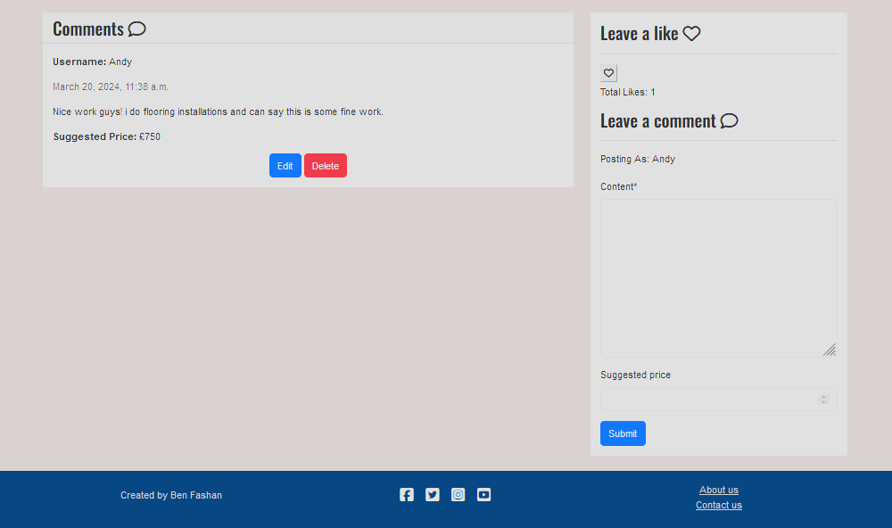
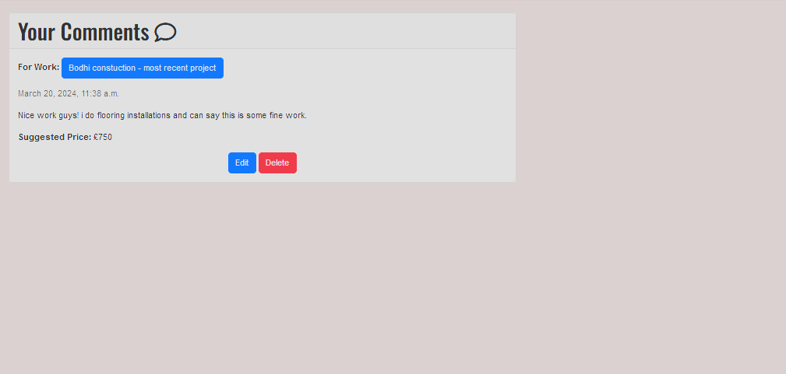

# [RATETHEWORK](https://rate-the-work-0f63389025f9.herokuapp.com)

[](https://github.com/BenFash/RateTheWork/commits/main)
[](https://github.com/BenFash/RateTheWork/commits/main)
[](https://github.com/BenFash/RateTheWork)


Welcome to Rate The Work a vibrant online community dedicated to sharing and evaluating creative projects from individuals and companies worldwide.

At Rate the Work, we believe that constructive feedback and collaboration are essential for personal and professional growth. Whether you're an artist, designer, freelancer, entrepreneur, or company our platform provides a supportive environment where you can showcase your work, receive valuable insights, and connect with like-minded individuals.

The site is also tailored for members of the public to post works completed for them to get a second opinion of the craftsmanship. Our mission is to empower users to refine their craft, make informed decisions, and elevate the quality of their projects. Through the exchange of feedback, ideas, and inspiration, we aim to foster creativity, innovation, and excellence across all industries. We encourage users to suggest how much they would pay for the work whilst making their comments.


## UX


In designing this project, my primary focus was on achieving a clean and simple design that prioritizes accessibility and ease of use. 
I aimed to ensure that all essential functions are readily available and easy to navigate, with responsiveness integrated through Bootstrap.

### Colour Scheme


For the colour scheme, I opted for a clean and minimalist approach, with blue as the dominant colour to reflect a sense of professionalism and tranquility. 
Here are the key colours used throughout the project:


- `#D7CDCC`: off-white color used for the body of website and nav and footer text.
- `#034078`:  indigo-blue color used for the nav, footer.
- `#001F54`: dark blue used for font and logo 

I used [coolors.co](https://coolors.co/d7cdcc-034078-001f54-0074d9-fefcfb) to generate my colour palette.


I've have also used CSS `:root` variables to easily update the global colour scheme by changing only one value, instead of everywhere in the CSS file.

```css
:root {
    --body: #D7CDCC;
    --navfooter: #034078;
    --font-color: #001F54;
}
```

### Typography

To help me with font pairing I used fontpair.co. I settled on the below paring as Oswald's modern and bold style complements Source Sans Pro's clean and neutral design.

'Oswald' : Oswald is a bold and condensed font with strong geometric shapes, making it ideal for headlines and titles. 
    Its boldness contrasts well with the lighter weight and more open design of Source Sans Pro, creating visual interest,
    'Source Sans Pro' : Source Sans Pro is designed for optimal readability on screens ideal for text other than headers.

The overall pairing of Oswald and Source Sans Pro fonts provides a harmonious balance of boldness and readability, making them well-suited for my project.

- [Oswald](https://fonts.google.com/specimen/Oswald?query=Oswald) was used for the primary headers and titles.

- Source Sans Pro was used for all other font. 

- [Font Awesome](https://fontawesome.com) icons were used throughout the site. For the social media icons in the footer and icons in work_details.html cards.

## User Stories

### New Site Users

- As a user I would like to be able to search for posts based on keywords or categories, so that I can find relevant content.
- As a user I would like to be able to view posts so that I can see works completed/received by the community.
- As a user I would like to be able to contact admin so that I can provide feedback and suggestions.
- As a user I would like to know that i am at the correct site so that I can be ensured im engaging with the correct community.
- As a user I would like to sign up to the site so that I can make posts and comments.

### Returning Site Users

- As a registered user I would like to be able to create a new post so that i can showcase my work/project in order to receive feedback from the community.
- As a registered user I would like to comment on posts made by other users so that i can provide feedback and engage with the community.
- As a registered user I would like to to be able to like/dislike posts made by other users so that i can provide quick feedback.
- As a registered user I would like to be able to view my own posts so that i can keep track of my contributions to the platform.
- As a registered user I would like to be able to edit and delete my comments so that i can amend them if i have made a mistake.
- As a registered user I would like to be able to edit and delete my posts so that i can edit and amend if needed.
- As a registered user I would like to upload a profile picture so that i can add personality to my account.

### Site Admin

- As a site administrator I would like to be able to approve posts and comments so that i can maintain a positive and respectful community environment.
- As site administrator I would like to have a about page so that i can give users more info about the site.

## Wireframes

Wireframes were developed for mobile and desktop sizes.
I've used [Balsamiq](https://balsamiq.com/wireframes) to design my site wireframes.

### Mobile Wireframes

<details>
<summary> Click here to see the Mobile Wireframes</summary>

Home
  - 

Works
  - 

Works Detail
  - 

Profile
  - 

Profile Pic Upload
  - 

Profile Comments
  - 

Profile Posts
  - 

Profile Likes
  - 

Profile Contact
  - 

About Us
  -   

Contact Us
  -   
</details>

### Desktop Wireframes

<details>
<summary> Click here to see the Desktop Wireframes </summary>

Home
  - 

Works
  - 

Works Detail
  - 

Profile
  - 

Profile Pic Upload
  - 

Profile Comments
  - 

Profile Posts
  - 

Profile Likes
  - 

Profile Contact
  - 

About Us
  -   

Contact Us
  -   
</details>

## Features

### Existing Features

- **Navbar**

    - The navigation bar offers access to essential features, ensuring a smooth user experience. 
    Users can effortlessly navigate between the "Home," "Work," "Login," and "Register" options. Once logged in,
    additional functionalities like "Profile" and "Logout" become available.

    - For registered users, the "Profile Picture" feature enhances personalization.
    In the absence of an uploaded image, a placeholder is displayed, maintaining visual consistency.
    Clicking on the profile picture or selecting "Profile" directs users to their individual profile page,
    where they can manage their account. Furthermore, users can easily return to the home page by clicking 
    on the site logo, facilitating intuitive navigation throughout the platform.

<details>
<summary> Click here to see the Navbar views</summary>

Non logged in user Navbar view
  - 

Logged in user with uploaded pic Navbar view
  - 

Logged in user with placeholder pic Navbar view
  - 

Mobile Navbar View
  - 
</details>

- **Footer**

    - The footer serves as a hub for social engagement and important site information, 
    fostering a strong connection between users and administrators. Users can explore various
    social media links used by site administrators, facilitating active interaction and community engagement.
    Additionally, the footer provides quick access to essential pages such as "About Us" and "Contact Us," 
    allowing users to gain insights into the platform's mission and easily reach out for assistance or inquiries.
    Together, these elements create a cohesive user experience, promoting accessibility and transparency within the platform.

<details>
<summary> Click here to see the Footer views</summary>

Footer View
  - 

Mobile Footer View
  - 
</details>

- **Search Function**

    - There is a search function on the home page to allow users to easily filter through work. 
    The work then paginates on the home page below the page intro. The filters for the search are;
    title, content, sub_category, categories and username.

<details>
<summary> Click here to see the Search views</summary> 

Search Bar View
  - 

Search Results View 
  - 

Search Pagination
  - 

</details>

- **Works Page**

    - Works page serves as a centralized hub for your posts, displaying them in a user-friendly format with
    the latest creations showcased first. Pagination facilitates easy navigation through multiple posts. 
    If users are logged in, they gain access to a prominent "Create Post" button and page intro. The Works 
    cards hold key info like title, likes, category and brief description 

<details>
<summary> Click here to see the Works views</summary> 

Logged In View
  - 

Non Logged in View
  - 

Pagination View
  - 

</details>

- **Work Details Page**

    - Work details page offers a comprehensive view of each post, including a photo, description, categories, and a comments section. 
    Registered users have the ability to interact further by leaving likes, comments, and suggesting a price for the work. 
    This page is designed to foster engagement and collaboration among users, allowing them to appreciate and provide feedback on
    creations while also potentially monetizing them through suggested prices. If you are the user of a posted comment you can edit and delete
    from this page. Also if you are owner of the post can edit and delete post. 

<details>
<summary> Click here to see the Work Details view</summary> 

Logged in and Comment Owner View
  - 
  - 

Post Owner View
  - 

Non Logged In View
  - 

</details>

- **Profile Page**

    -  Overall, the profile page offers a one-stop destination for users to customize their experience, review their contributions, 
    explore their activity, and connect with administrative support when needed. Only available to signed up users

<details>
<summary> Click here to see the Profile view</summary> 

Profile View
  - 

Profile Picture view - allows upload of profile picture an to select a user type
  - 

Your Comments view - allows user to view all of their comments. Giving them a link to the post and allowing for comments delete or edit. 
  - 

Your Posts view - allows user to view all their posts made to the platform 
  - 

Your Likes view - allows user to view all the posts they have liked on the platform 
  - 

Contact Admin - allows user to send a message to admin if needed.
  - 
</details>

- **About Us Page**

    - About us page just provides users with a brief websites mission. All users can view this page

<details>
<summary> Click here to see the About Us view</summary> 

  - 

</details>

- **Contact Us Page**

    - Contact us page allows non registered users to contact admin if needed 

<details>
<summary> Click here to see the Contact Us view</summary> 

  - 

</details>


### Future Features

- Search by Category
    - Implement a search functionality that allows users to filter works by category. 
    This feature enhances user experience by enabling them to find relevant content more efficiently 
- Direct Messaging Service
    - Introduce a direct messaging service to facilitate communication between community members. 
    Users can reach out to each other for quotes or collaborations after viewing each other's work. 
    This enhances networking and collaboration within the community.
- Company and User Home Pages
    - Create dedicated home pages for companies and users to showcase their works and relevant information. 
    This feature provides a centralized platform for users to present their portfolio, 
    allowing for greater visibility and engagement.

These future features aim to enhance user experience, foster collaboration
and provide a comprehensive platform for showcasing and connecting with others within the community.

## Tools & Technologies Used
- [](https://git-scm.com) used for version control. (`git add`, `git commit`, `git push`)
- [](https://github.com) used for secure online code storage.
- [](https://code.visualstudio.com) used as my local IDE for development.
- [](https://en.wikipedia.org/wiki/HTML) used for the main site content.
- [](https://en.wikipedia.org/wiki/CSS) used for the main site design and layout.
- [](https://www.python.org) used as the back-end programming language.
- [](https://www.heroku.com) used for hosting the deployed back-end site.
- [](https://getbootstrap.com) used as the front-end CSS framework for modern responsiveness and pre-built components.
- [](https://www.djangoproject.com) used as the Python framework for the site.
- [](https://www.elephantsql.com) used as the Postgres database.
- [](https://cloudinary.com) used for online static file storage.
- [](https://whitenoise.readthedocs.io) used for serving static files with Heroku.
- [](https://balsamiq.com/wireframes) used for creating wireframes.
- [](https://www.canva.com/) used for creating site logo.
- [](https://fontawesome.com) used for the icons.

## Database Design

- https://lucid.app/ used to create my EDR


## Agile Development Process

### GitHub Projects

[GitHub Projects](https://github.com/BenFash/RateTheWork/projects) served as an Agile tool for this project.
It isn't a specialized tool, but with the right tags and project creation/issue assignments, it can be made to work.

Through it, user stories, issues, and milestone tasks were planned, then tracked on a daily basis using the basic Kanban board.


### GitHub Issues

[GitHub Issues](https://github.com/BenFash/RateTheWork/issues) served as an another Agile tool.
There, I used my own **User Story Template** to manage user stories.

It also helped with milestone iterations on a daily basis.

<details>
<summary> Click here to see the Open & Closed Issues </summary> 

Open
  - 

Close
  - 

</details>


### MoSCoW Prioritization

I was able to apply the MoSCow prioritization and labels to my user stories within the Issues tab.

- **Must Have**: guaranteed to be delivered (*max 60% of stories*)
- **Should Have**: adds significant value, but not vital (*the rest ~20% of stories*)
- **Could Have**: has small impact if left out (*20% of stories*)
- **Won't Have**: not a priority for this iteration

## Testing

> [!NOTE]  
> For all testing, please refer to the [TESTING.md](TESTING.md) file.

## Deployment

The live deployed application can be found deployed on [Heroku](https://rate-the-work-0f63389025f9.herokuapp.com).


### Cloudinary API

This project uses the [Cloudinary API](https://cloudinary.com) to store media assets online, due to the fact that Heroku doesn't persist this type of data.

To obtain your own Cloudinary API key, create an account and log in.

- For *Primary interest*, you can choose *Programmable Media for image and video API*.
- Optional: *edit your assigned cloud name to something more memorable*.
- On your Cloudinary Dashboard, you can copy your **API Environment Variable**.
- Be sure to remove the `CLOUDINARY_URL=` as part of the API **value**; this is the **key**.

### ElephantSQL Database

This project uses [ElephantSQL](https://www.elephantsql.com) for the PostgreSQL Database.

To obtain your own Postgres Database, sign-up with your GitHub account, then follow these steps:

- Click **Create New Instance** to start a new database.
- Provide a name (this is commonly the name of the project: RateTheWork).
- Select the **Tiny Turtle (Free)** plan.
- You can leave the **Tags** blank.
- Select the **Region** and **Data Center** closest to you.
- Once created, click on the new database name, where you can view the database URL and Password.

### Heroku Deployment

This project uses [Heroku](https://www.heroku.com), a platform as a service (PaaS) that enables developers to build, run, and operate applications entirely in the cloud.

Deployment steps are as follows, after account setup:

- Select **New** in the top-right corner of your Heroku Dashboard, and select **Create new app** from the dropdown menu.
- Your app name must be unique, and then choose a region closest to you (EU or USA), and finally, select **Create App**.
- From the new app **Settings**, click **Reveal Config Vars**, and set your environment variables.

Heroku needs three additional files in order to deploy properly.

- requirements.txt
- Procfile
- runtime.txt

You can install this project's **requirements** (where applicable) using:

- `pip3 install -r requirements.txt`

If you have your own packages that have been installed, then the requirements file needs updated using:

- `pip3 freeze --local > requirements.txt`

The **Procfile** can be created with the following command:

- `echo web: gunicorn app_name.wsgi > Procfile`
- *replace **app_name** with the name of your primary Django app name; the folder where settings.py is located*

The **runtime.txt** file needs to know which Python version you're using:
1. type: `python3 --version` in the terminal.
2. in the **runtime.txt** file, add your Python version:
	- `python-3.9.18`

For Heroku deployment, follow these steps to connect your own GitHub repository to the newly created app:

Either:

- Select **Automatic Deployment** from the Heroku app.

Or:

- In the Terminal/CLI, connect to Heroku using this command: `heroku login -i`
- Set the remote for Heroku: `heroku git:remote -a app_name` (replace *app_name* with your app name)
- After performing the standard Git `add`, `commit`, and `push` to GitHub, you can now type:
	- `git push heroku main`

The project should now be connected and deployed to Heroku!

### Local Deployment

This project can be cloned or forked in order to make a local copy on your own system.

For either method, you will need to install any applicable packages found within the *requirements.txt* file.

- `pip3 install -r requirements.txt`.

You will need to create a new file called `env.py` at the root-level,
and include the same environment variables listed above from the Heroku deployment steps.

> [!IMPORTANT]  
> This is a sample only; you would replace the values with your own if cloning/forking my repository.

Sample `env.py` file:

```python
import os

os.environ.setdefault("CLOUDINARY_URL", "user's own value")
os.environ.setdefault("DATABASE_URL", "user's own value")
os.environ.setdefault("SECRET_KEY", "user's own value")

# local environment only (do not include these in production/deployment!)
os.environ.setdefault("DEBUG", "True")
```

Once the project is cloned or forked, in order to run it locally, you'll need to follow these steps:

- Start the Django app: `python3 manage.py runserver`
- Stop the app once it's loaded: `CTRL+C` or `⌘+C` (Mac)
- Make any necessary migrations: `python3 manage.py makemigrations`
- Migrate the data to the database: `python3 manage.py migrate`
- Create a superuser: `python3 manage.py createsuperuser`
- Load fixtures (if applicable): `python3 manage.py loaddata file-name.json` (repeat for each file)
- Everything should be ready now, so run the Django app again: `python3 manage.py runserver`

#### Cloning

You can clone the repository by following these steps:

1. Go to the [GitHub repository](https://github.com/BenFash/RateTheWork) 
2. Locate the Code button above the list of files and click it 
3. Select if you prefer to clone using HTTPS, SSH, or GitHub CLI and click the copy button to copy the URL to your clipboard
4. Open Git Bash or Terminal
5. Change the current working directory to the one where you want the cloned directory
6. In your IDE Terminal, type the following command to clone my repository:
	- `git clone https://github.com/BenFash/RateTheWork.git`
7. Press Enter to create your local clone.

Alternatively, if using Gitpod, you can click below to create your own workspace using this repository.

[](https://gitpod.io/#https://github.com/BenFash/RateTheWork)

Please note that in order to directly open the project in Gitpod, you need to have the browser extension installed.
A tutorial on how to do that can be found [here](https://www.gitpod.io/docs/configure/user-settings/browser-extension).

#### Forking

By forking the GitHub Repository, we make a copy of the original repository on our GitHub account to view and/or make changes without affecting the original owner's repository.
You can fork this repository by using the following steps:

1. Log in to GitHub and locate the [GitHub Repository](https://github.com/BenFash/RateTheWork)
2. At the top of the Repository (not top of page) just above the "Settings" Button on the menu, locate the "Fork" Button.
3. Once clicked, you should now have a copy of the original repository in your own GitHub account!

### Local VS Deployment

The Django Admin dashboard appears slightly different on the local (VSCode) version when compared to the deployed (Heroku) application.

Otherwise, everything else is behaving as expected.

## Credits

I extend my gratitude to Code Institute for their invaluable support throughout the creation of this project. 
My experience with Django, acquired through their program, notably during the development of a blog site, provided me with profound insights and inspiration for my final project. Here's the repo to the blog site [GitHub Repository](https://github.com/BenFash/django_project)

Prior to this project, I engaged in a preparatory exercise by following a walkthrough to construct a recipe site led by "Dee Mc." This endeavor not only honed my skills but also served as a precursor to my project's development. Here are the links to the video tutorial [Youtube](https://www.youtube.com/watch?v=sBjbty691eI&list=PLXuTq6OsqZjbCSfiLNb2f1FOs8viArjWy) and the corresponding repository on [GitHub Repository](https://github.com/BenFash/Django-recipe-test)

### Content

| Source | Location | Notes |
| --- | --- | --- |
| [Markdown Builder](https://tim.2bn.dev/markdown-builder) | README and TESTING | tool to help generate the Markdown files |
| [Bootstrap](https://getbootstrap.com/) | across site styling | referenced for positioning and speicifcally the cards used |
| [Code Institute](https://github.com/Code-Institute-Solutions/Django3blog/blob/master/12_final_deployment/blog/models.py) | work model | like function |
| [YouTube](https://www.youtube.com/watch?v=LsU79aY79UA&list=PLXuTq6OsqZjbCSfiLNb2f1FOs8viArjWy&index=15) | home | search bar function |
| [Django](https://docs.djangoproject.com/en/4.2/ref/templates/builtins/#truncatechars) | work cards | tutorial for adding truncate to work description for cards |

### Media

| Source | Location | Type | Notes |
| --- | --- | --- | --- |
| [Canva](https://www.canva.com/design/DAF_NBMCsns/NqNqnzXDu8P-p6tM88GvXA/edit) | site logo + favicon | image | site logo + favicon on all pages |
| [Code Institute](https://github.com/BenFash/django_project)| navbar | placeholder profile image | nobody.png |
| [Pixabay](https://pixabay.com) | gallery page | image | "construction" group of photos for uploaded work, the other images in work are real users images |
| [Fontawesome](https://fontawesome.com/) | footer + work details cards | icons | social icons in footer + comments, likes, category and description icons in work details page |
| [jpeg.io](https://www.jpeg.io/) | entire site | image | tool for image compression |

### Acknowledgements

- I would like to thank my Code Institute mentor, [Tim Nelson](https://github.com/TravelTimN) for his support throughout the development of this project. Work on the models helped prevent drastic amendments on them avoiding major database issues 
- I would like to thank the [Code Institute](https://codeinstitute.net) bootcamp support team for their assistance with troubleshooting and debugging some project issues. For example heroku deployment not auto collecting static files. 
- I would like to thank the [Code Institute Slack community](https://code-institute-room.slack.com) for the moral support; it kept me going during periods of self doubt and imposter syndrome. The camaraderie within the Bootcamp cohort was truly inspiring; together, we navigated through challenges and celebrated successes during our project periods. It's the collective motivation in our stand-ups that truly made the journey easier. 
- I would like to thank my partner Briony, for believing in me, and allowing me to make this transition into software development. It has been a testing time just having a new born a week before project start date. 
