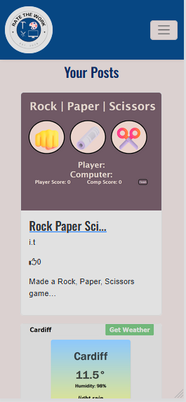
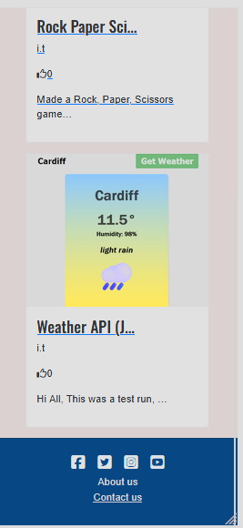
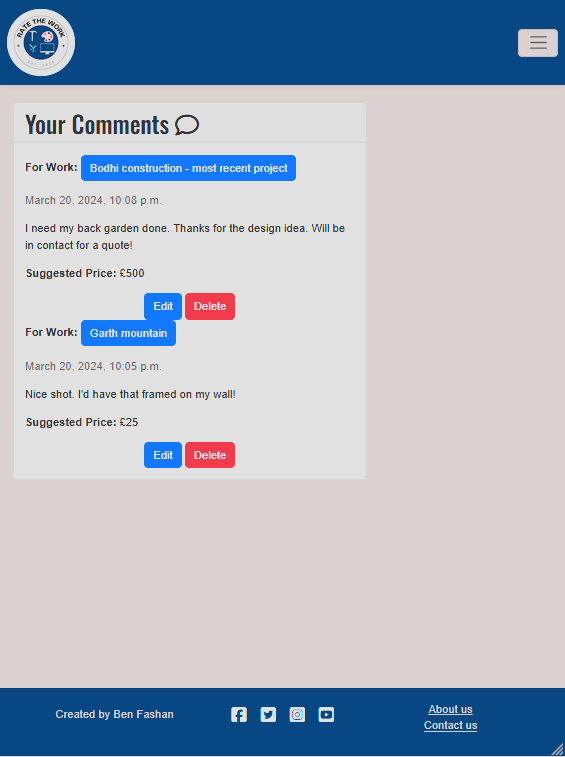
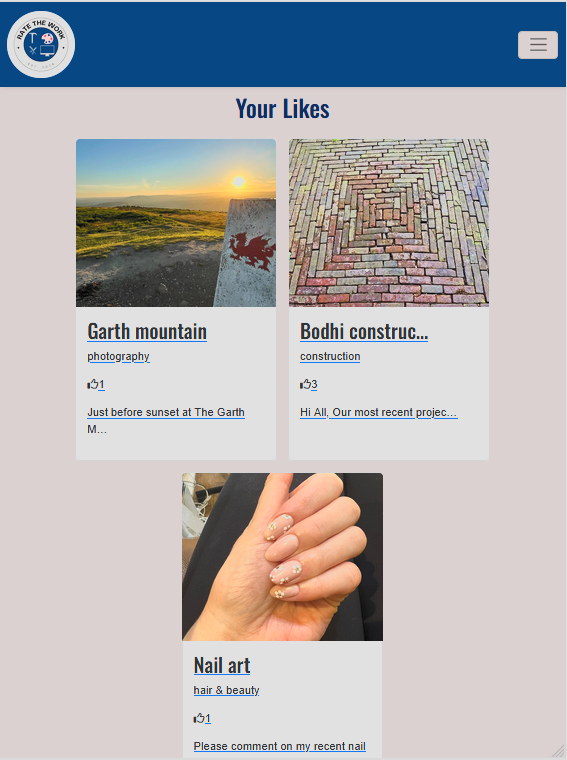

# Testing

> [!NOTE]  
> Return back to the [README.md](README.md) file.

## Code Validation

### HTML

I have used the recommended [HTML W3C Validator](https://validator.w3.org) to validate all of my HTML files.

| Directory | File | Screenshot | Notes |
| --- | --- | --- | --- |
| about | about.html |  | |
| blog | comment_delete.html |  | |
| blog | comment_edit.html |  | |
| blog | work.html |  | |
| blog | work_create.html |  | |
| blog | work_delete.html |  | |
| blog | work_details.html |  | |
| blog | work_edit.html |  | |
| contact | contact.html |  | |
| home | index.html |  | |
| templates | base.html |  | |
| templates | index.html |  | |
| templates | signup.html/allauth |  | Known errors with allauth register page |
| templates | logout.html/allauth |  | |
| templates | login.html/allauth |  | |
| user_dashboard | profile.html |  | |
| user_dashboard | profile_comments.html |  | |
| user_dashboard | profile_contact.html |  | |
| user_dashboard | profile_likes.html |  | |
| user_dashboard | profile_picture.html |  | |
| user_dashboard | profile_posts.html |  | |

### CSS

I have used the recommended [CSS Jigsaw Validator](https://jigsaw.w3.org/css-validator) to validate all of my CSS files.

| Directory | File | Screenshot | Notes |
| --- | --- | --- | --- |
| static | style.css |  | |

### Python

I have used the recommended [PEP8 CI Python Linter](https://pep8ci.herokuapp.com) to validate all of my Python files.

| Directory | File | CI URL | Screenshot | Notes |
| --- | --- | --- | --- | --- |
| about | urls.py | [PEP8 CI](https://pep8ci.herokuapp.com/https://raw.githubusercontent.com/BenFash/RateTheWork/main/about/urls.py) |  | |
| about | views.py | [PEP8 CI](https://pep8ci.herokuapp.com/https://raw.githubusercontent.com/BenFash/RateTheWork/main/about/views.py) |  | |
| blog | admin.py | [PEP8 CI](https://pep8ci.herokuapp.com/https://raw.githubusercontent.com/BenFash/RateTheWork/main/blog/admin.py) |  | |
| blog | forms.py | [PEP8 CI](https://pep8ci.herokuapp.com/https://raw.githubusercontent.com/BenFash/RateTheWork/main/blog/forms.py) |  | |
| blog | models.py | [PEP8 CI](https://pep8ci.herokuapp.com/https://raw.githubusercontent.com/BenFash/RateTheWork/main/blog/models.py) |  | |
| blog | urls.py | [PEP8 CI](https://pep8ci.herokuapp.com/https://raw.githubusercontent.com/BenFash/RateTheWork/main/blog/urls.py) |  | |
| blog | views.py | [PEP8 CI](https://pep8ci.herokuapp.com/https://raw.githubusercontent.com/BenFash/RateTheWork/main/blog/views.py) |  | |
| contact | admin.py | [PEP8 CI](https://pep8ci.herokuapp.com/https://raw.githubusercontent.com/BenFash/RateTheWork/main/contact/admin.py) |  | |
| contact | forms.py | [PEP8 CI](https://pep8ci.herokuapp.com/https://raw.githubusercontent.com/BenFash/RateTheWork/main/contact/forms.py) |  | |
| contact | models.py | [PEP8 CI](https://pep8ci.herokuapp.com/https://raw.githubusercontent.com/BenFash/RateTheWork/main/contact/models.py) |  | |
| contact | urls.py | [PEP8 CI](https://pep8ci.herokuapp.com/https://raw.githubusercontent.com/BenFash/RateTheWork/main/contact/urls.py) |  | |
| contact | views.py | [PEP8 CI](https://pep8ci.herokuapp.com/https://raw.githubusercontent.com/BenFash/RateTheWork/main/contact/views.py) |  | |
| home | urls.py | [PEP8 CI](https://pep8ci.herokuapp.com/https://raw.githubusercontent.com/BenFash/RateTheWork/main/home/urls.py) |  | |
| home | views.py | [PEP8 CI](https://pep8ci.herokuapp.com/https://raw.githubusercontent.com/BenFash/RateTheWork/main/home/views.py) |  | |
|  | manage.py | [PEP8 CI](https://pep8ci.herokuapp.com/https://raw.githubusercontent.com/BenFash/RateTheWork/main/manage.py) |  | |
| rate_the_work | settings.py | [PEP8 CI](https://pep8ci.herokuapp.com/https://raw.githubusercontent.com/BenFash/RateTheWork/main/rate_the_work/settings.py) |  | |
| rate_the_work | urls.py | [PEP8 CI](https://pep8ci.herokuapp.com/https://raw.githubusercontent.com/BenFash/RateTheWork/main/rate_the_work/urls.py) |  | |
| user_dashboard | admin.py | [PEP8 CI](https://pep8ci.herokuapp.com/https://raw.githubusercontent.com/BenFash/RateTheWork/main/user_dashboard/admin.py) |  | |
| user_dashboard | forms.py | [PEP8 CI](https://pep8ci.herokuapp.com/https://raw.githubusercontent.com/BenFash/RateTheWork/main/user_dashboard/forms.py) |  | |
| user_dashboard | models.py | [PEP8 CI](https://pep8ci.herokuapp.com/https://raw.githubusercontent.com/BenFash/RateTheWork/main/user_dashboard/models.py) |  | |
| user_dashboard | urls.py | [PEP8 CI](https://pep8ci.herokuapp.com/https://raw.githubusercontent.com/BenFash/RateTheWork/main/user_dashboard/urls.py) |  | |
| user_dashboard | views.py | [PEP8 CI](https://pep8ci.herokuapp.com/https://raw.githubusercontent.com/BenFash/RateTheWork/main/user_dashboard/views.py) |  | |

## Browser Compatibility

I've tested my deployed project on the main 3 browsers to check for compatibility issues.

| Browser | Home | Work | About | Contact | Signin | Signout | Work Details | Comment Edit | Comment Delete | Profile | Profile Picture | Your Comments | Your Posts | Your Likes | Profile Contact | Register | Work Delete | Work Edit | Notes |
| --- | --- | --- | --- | --- | --- | --- | --- | --- | --- | --- | --- | --- | --- | --- | --- | --- | --- | --- | --- |
| Chrome |  |  |  |  |  |  |   |  |  |  |  |  |   |  |  |  |  |  | Works as expected |
| Firefox |  |  |  |  |  |  |   |  |  |  |  |  |   |  |  |  | |  | Works as expected |
| Edge |  |  |  |  |  |  |   |  |  |  |  |  |   |  |  |  |  |  | Works as expected |

## Responsiveness

I've tested my deployed project on multiple devices to check for responsiveness issues using Devtools. 

| Device | Home | Work | About | Contact | Signin | Signout | Work Details | Comment Edit | Comment Delete | Profile | Profile Picture | Your Comments | Your Posts | Your Likes | Profile Contact | Register | Work Delete | Work Edit | Notes |
| --- | --- | --- | --- | --- | --- | --- | --- | --- | --- | --- | --- | --- | --- | --- | --- | --- | --- | --- | --- |
| Mobile (DevTools) |  |     |   |   |  |  |     |  |  |   |  |   |   |    |  |  |  |   | Works as expected |
| Tablet (DevTools) |  |   |  |  |  |  |   |  |  |  |  |  |  |   |  |  |  |  | Works as expected, edit button on your comments page sits close to "for work" line |
| Desktop (DevTools) |  |  |  |  |  |  |   |  |  |  |  |  |  |  |  |  |  |   | Works as expected |

## Lighthouse Audit

🛑🛑🛑🛑🛑🛑🛑🛑🛑🛑-START OF NOTES (to be deleted)

Use this space to discuss testing the live/deployed site's Lighthouse Audit reports.
Avoid testing the local version (especially if developing in Gitpod), as this can have knock-on effects of performance.

If you don't have Lighthouse in your Developer Tools,
it can be added as an [extension](https://chrome.google.com/webstore/detail/lighthouse/blipmdconlkpinefehnmjammfjpmpbjk).

Don't just test the home page (unless it's a single-page application).
Make sure to test the Lighthouse Audit results for all of your pages.

**IMPORTANT**: You must provide screenshots of the results, to "prove" that you've actually tested them.

Sample Lighthouse testing documentation:

🛑🛑🛑🛑🛑🛑🛑🛑🛑🛑-END OF NOTES (to be deleted)

I've tested my deployed project using the Lighthouse Audit tool to check for any major issues.

| Page | Mobile | Notes |
| --- | --- | --- |
| Home |  |  | Score: 90/95/100/92 |
| Work |  |  | Score: 85/100/78/92 with user uploaded pictures loading times increased |
| About |  |  | Score: 89/100/100/92 |
| Contact |  |  | Score: 89/100/100/92 |
| Work Details |  |  | score: 74/100/78/92 |
| Comment Edit (unable to run) |  |  | unable to run - "Lighthouse returned error: ERRORED_DOCUMENT_REQUEST. Lighthouse was unable to reliably load the page you requested. Make sure you are testing the correct URL and that the server is properly responding to all requests. (Status code: 404)" |
| Comment Delete (unable to run) |  |  | unable to run - "Lighthouse returned error: ERRORED_DOCUMENT_REQUEST. Lighthouse was unable to reliably load the page you requested. Make sure you are testing the correct URL and that the server is properly responding to all requests. (Status code: 404)" |
| Profile |  |  | Some minor warnings |
| Profile Picture |  |  | Some minor warnings |
| Your Comments |  |  | Some minor warnings |
| Your Posts |  |  | Some minor warnings |
| Your Likes |  |  | Some minor warnings |
| Profile Contact |  |  | Some minor warnings |
| Register |  |  | Some minor warnings |
| Work Delete |  |  | Some minor warnings |
| Work Edit |  |  | Some minor warnings |

## Defensive Programming

🛑🛑🛑🛑🛑🛑🛑🛑🛑🛑-START OF NOTES (to be deleted)

Defensive programming (defensive design) is extremely important!

When building projects that accept user inputs or forms, you should always test the level of security for each.
Examples of this could include (not limited to):

Forms:
- Users cannot submit an empty form
- Users must enter valid email addresses

PP3 (Python-only):
- Users must enter a valid letter/word/string when prompted
- Users must choose from a specific list only

MS3 (Flask) | MS4/PP4/PP5 (Django):
- Users cannot brute-force a URL to navigate to a restricted page
- Users cannot perform CRUD functionality while logged-out
- User-A should not be able to manipulate data belonging to User-B, or vice versa
- Non-Authenticated users should not be able to access pages that require authentication
- Standard users should not be able to access pages intended for superusers

You'll want to test all functionality on your application, whether it's a standard form,
or uses CRUD functionality for data manipulation on a database.
Make sure to include the `required` attribute on any form-fields that should be mandatory.
Try to access various pages on your site as different user types (User-A, User-B, guest user, admin, superuser).

Defensive programming was manually tested with the below user acceptance testing:

| Page | User Action | Expected Result | Pass/Fail | Comments |
| --- | --- | --- | --- | --- |
| Home | | | | |
| | Click on Logo | Redirection to Home page | Pass | |
| | Click on Home link in navbar | Redirection to Home page | Pass | |
| | Click on Work link in navbar | Redirection to Work page | Pass | |
| | Click on Login link in navbar | Redirection to Login page | Pass | |
| | Click on Register link in navbar | Redirection to Register page | Pass | |
| | Click on Logout link in navbar | Redirection to Logout page | Pass | |
| | Click on Profile link in navbar | Redirection to Profile page | Pass | |
| | Click on Profile picture in navbar | Redirection to Profile page | Pass | |
| | Click on Search in body | Presents results | Pass | |
| | Click on Pagination next in body | Presents next page | Pass | searched "hi" |
| | Click on Pagination previous in body | Presents previous page | Pass | |
| | Click on Social links in footer | All redirect to relevant sites  | Pass | |
| | Click on About us in footer | All redirect to About us page  | Pass | |
| | Click on Contact us in footer | All redirect to Contact us page  | Pass | |
| Work | | | | |
| | Click on Create Work link in body| Redirection to Create Work page | Pass | |
| | Click work cards | All cards load as expected | Pass | |
| | Click on Pagination next in body | Presents next page | Pass | |
| | Click on Pagination previous in body | Presents previous page | Pass | |
| Contact | | | | |
| | Left Name field empty | Required field prevents submit | Pass | |
| | Left Subject field empty | Required field prevents submit | Pass | |
| | Left Email field empty | Required field prevents submit also requires email formatting inputted | Pass | |
| | Left Message field empty | Required field prevents submit | Pass | |
| | Click Submit | Form sends off to admin | Pass | |
| Signin | | | | |
| | Click on the Login link | Redirection to Login page | Pass | |
| | Enter valid email address | Field will only accept email address format | Pass | |
| | Enter valid password | Field will only accept password format | Pass | |
| | Click Login button | Redirects user to home page | Pass | |
| Signout | | | | |
| | Click Logout button | Redirects user to logout page | Pass | Confirms logout first |
| | Click Confirm Logout button | Redirects user to home page | Pass | |
| Work Details  | | | | |
| | Click on Profile button | User will be redirected to the Profile page | Pass | |
| | Click on the Edit button | User will be redirected to the edit profile page | Pass | |
| | Click on the My Orders link | User will be redirected to the My Orders page | Pass | |
| | Brute forcing the URL to get to another user's profile | User should be given an error | Pass | Redirects user back to own profile |
| Comment Edit | | | | |
| | Click Logout button | Redirects user to logout page | Pass | Confirms logout first |
| | Click Confirm Logout button | Redirects user to home page | Pass | |
| Comment Delete | | | | |
| | Click Logout button | Redirects user to logout page | Pass | Confirms logout first |
| | Click Confirm Logout button | Redirects user to home page | Pass | |
| Profile | | | | |
| | Click Logout button | Redirects user to logout page | Pass | Confirms logout first |
| | Click Confirm Logout button | Redirects user to home page | Pass | |
| Profile Picture | | | | |
| | Click Logout button | Redirects user to logout page | Pass | Confirms logout first |
| | Click Confirm Logout button | Redirects user to home page | Pass | |
| Your Comments | | | | |
| | Click Logout button | Redirects user to logout page | Pass | Confirms logout first |
| | Click Confirm Logout button | Redirects user to home page | Pass | |
| Your Posts | | | | |
| | Click Logout button | Redirects user to logout page | Pass | Confirms logout first |
| | Click Confirm Logout button | Redirects user to home page | Pass | |
| Your Likes | | | | |
| | Click Logout button | Redirects user to logout page | Pass | Confirms logout first |
| | Click Confirm Logout button | Redirects user to home page | Pass | |
| Profile Contact | | | | |
| | Click Logout button | Redirects user to logout page | Pass | Confirms logout first |
| | Click Confirm Logout button | Redirects user to home page | Pass | |
| Register | | | | |
| | Click Logout button | Redirects user to logout page | Pass | Confirms logout first |
| | Click Confirm Logout button | Redirects user to home page | Pass | |
| Work Delete | | | | |
| | Click Logout button | Redirects user to logout page | Pass | Confirms logout first |
| | Click Confirm Logout button | Redirects user to home page | Pass | |
| Work Edit | | | | |
| | Click Logout button | Redirects user to logout page | Pass | Confirms logout first |
| | Click Confirm Logout button | Redirects user to home page | Pass | |

## User Story Testing

🛑🛑🛑🛑🛑🛑🛑🛑🛑🛑-START OF NOTES (to be deleted)

Testing user stories is actually quite simple, once you've already got the stories defined on your README.

Most of your project's **features** should already align with the **user stories**,
so this should as simple as creating a table with the user story, matching with the re-used screenshot
from the respective feature.

🛑🛑🛑🛑🛑🛑🛑🛑🛑🛑-END OF NOTES (to be deleted)

| User Story | Screenshot |
| --- | --- |
| As a new site user, I would like to ____________, so that I can ____________. |  |
| As a new site user, I would like to ____________, so that I can ____________. |  |
| As a new site user, I would like to ____________, so that I can ____________. |  |
| As a returning site user, I would like to ____________, so that I can ____________. |  |
| As a returning site user, I would like to ____________, so that I can ____________. |  |
| As a returning site user, I would like to ____________, so that I can ____________. |  |
| As a site administrator, I should be able to ____________, so that I can ____________. |  |
| As a site administrator, I should be able to ____________, so that I can ____________. |  |
| As a site administrator, I should be able to ____________, so that I can ____________. |  |
| repeat for all remaining user stories | x |

## Bugs

🛑🛑🛑🛑🛑🛑🛑🛑🛑🛑-START OF NOTES (to be deleted)

This section is primarily used for JavaScript and Python applications,
but feel free to use this section to document any HTML/CSS bugs you might run into.

It's very important to document any bugs you've discovered while developing the project.
Make sure to include any necessary steps you've implemented to fix the bug(s) as well.

**PRO TIP**: screenshots of bugs are extremely helpful, and go a long way!

🛑🛑🛑🛑🛑🛑🛑🛑🛑🛑-END OF NOTES (to be deleted)

- JS Uncaught ReferenceError: `foobar` is undefined/not defined

    

    - To fix this, I _____________________.

- JS `'let'` or `'const'` or `'template literal syntax'` or `'arrow function syntax (=>)'` is available in ES6 (use `'esversion: 11'`) or Mozilla JS extensions (use moz).

    

    - To fix this, I _____________________.

- Python `'ModuleNotFoundError'` when trying to import module from imported package

    

    - To fix this, I _____________________.

- Django `TemplateDoesNotExist` at /appname/path appname/template_name.html

    

    - To fix this, I _____________________.

- Python `E501 line too long` 

    

    - To fix this, I _____________________.

### GitHub **Issues**

🛑🛑🛑🛑🛑🛑🛑🛑🛑🛑-START OF NOTES (to be deleted)

An improved way to manage bugs is to use the built-in **Issues** tracker on your GitHub repository.
To access your Issues, click on the "Issues" tab at the top of your repository.
Alternatively, use this link: https://github.com/BenFash/RateTheWork/issues

If using the Issues tracker for your bug management, you can simplify the documentation process.
Issues allow you to directly paste screenshots into the issue without having to first save the screenshot locally,
then uploading into your project.

You can add labels to your issues (`bug`), assign yourself as the owner, and add comments/updates as you progress with fixing the issue(s).

Once you've sorted the issue, you should then "Close" it.

When showcasing your bug tracking for assessment, you can use the following format:

🛑🛑🛑🛑🛑🛑🛑🛑🛑🛑-END OF NOTES (to be deleted)

**Fixed Bugs**

All previously closed/fixed bugs can be tracked [here](https://github.com/BenFash/RateTheWork/issues?q=is%3Aissue+is%3Aclosed).

| Bug | Status |
| --- | --- |
| [JS Uncaught ReferenceError: `foobar` is undefined/not defined](https://github.com/BenFash/RateTheWork/issues/1) | Closed |
| [Python `'ModuleNotFoundError'` when trying to import module from imported package](https://github.com/BenFash/RateTheWork/issues/2) | Closed |
| [Django `TemplateDoesNotExist` at /appname/path appname/template_name.html](https://github.com/BenFash/RateTheWork/issues/3) | Closed |

**Open Issues**

Any remaining open issues can be tracked [here](https://github.com/BenFash/RateTheWork/issues).

| Bug | Status |
| --- | --- |
| [JS `'let'` or `'const'` or `'template literal syntax'` or `'arrow function syntax (=>)'` is available in ES6 (use `'esversion: 11'`) or Mozilla JS extensions (use moz).](https://github.com/BenFash/RateTheWork/issues/4) | Open |
| [Python `E501 line too long` (93 > 79 characters)](https://github.com/BenFash/RateTheWork/issues/5) | Open |

## Unfixed Bugs

🛑🛑🛑🛑🛑🛑🛑🛑🛑🛑-START OF NOTES (to be deleted)

You will need to mention unfixed bugs and why they were not fixed.
This section should include shortcomings of the frameworks or technologies used.
Although time can be a big variable to consider, paucity of time and difficulty understanding
implementation is not a valid reason to leave bugs unfixed.

If you've identified any unfixed bugs, no matter how small, be sure to list them here.
It's better to be honest and list them, because if it's not documented and an assessor finds the issue,
they need to know whether or not you're aware of them as well, and why you've not corrected/fixed them.

Some examples:

🛑🛑🛑🛑🛑🛑🛑🛑🛑🛑-END OF NOTES (to be deleted)

- On devices smaller than 375px, the page starts to have `overflow-x` scrolling.

    

    - Attempted fix: I tried to add additional media queries to handle this, but things started becoming too small to read.

- For PP3, when using a helper `clear()` function, any text above the height of the terminal does not clear, and remains when you scroll up.

    

    - Attempted fix: I tried to adjust the terminal size, but it only resizes the actual terminal, not the allowable area for text.

- When validating HTML with a semantic `section` element, the validator warns about lacking a header `h2-h6`. This is acceptable.

    

    - Attempted fix: this is a known warning and acceptable, and my section doesn't require a header since it's dynamically added via JS.

🛑🛑🛑🛑🛑🛑🛑🛑🛑🛑-START OF NOTES (to be deleted)

If you legitimately cannot find any unfixed bugs or warnings, then use the following sentence:

🛑🛑🛑🛑🛑🛑🛑🛑🛑🛑-END OF NOTES (to be deleted)

> [!NOTE]  
> There are no remaining bugs that I am aware of.
