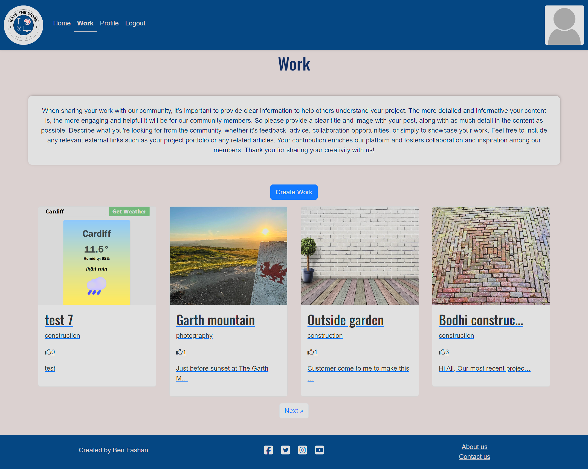

# Testing

> [!NOTE]  
> Return back to the [README.md](README.md) file.

## Code Validation

### HTML

I have used the recommended [HTML W3C Validator](https://validator.w3.org) to validate all of my HTML files.

| Directory | File | Screenshot | Notes |
| --- | --- | --- | --- |
| about | about.html |  | |
| blog | comment_delete.html |  | |
| blog | comment_edit.html |  | |
| blog | work.html |  | |
| blog | work_create.html |  | |
| blog | work_delete.html |  | |
| blog | work_details.html |  | |
| blog | work_edit.html |  | |
| contact | contact.html |  | |
| home | index.html |  | |
| templates | base.html |  | |
| templates | index.html |  | |
| templates | signup.html/allauth |  | Known errors with allauth register page |
| templates | logout.html/allauth |  | |
| templates | login.html/allauth |  | |
| user_dashboard | profile.html |  | |
| user_dashboard | profile_comments.html |  | |
| user_dashboard | profile_contact.html |  | |
| user_dashboard | profile_likes.html |  | |
| user_dashboard | profile_picture.html |  | |
| user_dashboard | profile_posts.html |  | |

### CSS

I have used the recommended [CSS Jigsaw Validator](https://jigsaw.w3.org/css-validator) to validate all of my CSS files.

| Directory | File | Screenshot | Notes |
| --- | --- | --- | --- |
| static | style.css |  | |

### Python

I have used the recommended [PEP8 CI Python Linter](https://pep8ci.herokuapp.com) to validate all of my Python files.

| Directory | File | CI URL | Screenshot | Notes |
| --- | --- | --- | --- | --- |
| about | urls.py | [PEP8 CI](https://pep8ci.herokuapp.com/https://raw.githubusercontent.com/BenFash/RateTheWork/main/about/urls.py) |  | |
| about | views.py | [PEP8 CI](https://pep8ci.herokuapp.com/https://raw.githubusercontent.com/BenFash/RateTheWork/main/about/views.py) |  | |
| blog | admin.py | [PEP8 CI](https://pep8ci.herokuapp.com/https://raw.githubusercontent.com/BenFash/RateTheWork/main/blog/admin.py) |  | |
| blog | forms.py | [PEP8 CI](https://pep8ci.herokuapp.com/https://raw.githubusercontent.com/BenFash/RateTheWork/main/blog/forms.py) |  | |
| blog | models.py | [PEP8 CI](https://pep8ci.herokuapp.com/https://raw.githubusercontent.com/BenFash/RateTheWork/main/blog/models.py) |  | |
| blog | urls.py | [PEP8 CI](https://pep8ci.herokuapp.com/https://raw.githubusercontent.com/BenFash/RateTheWork/main/blog/urls.py) |  | |
| blog | views.py | [PEP8 CI](https://pep8ci.herokuapp.com/https://raw.githubusercontent.com/BenFash/RateTheWork/main/blog/views.py) |  | |
| contact | admin.py | [PEP8 CI](https://pep8ci.herokuapp.com/https://raw.githubusercontent.com/BenFash/RateTheWork/main/contact/admin.py) |  | |
| contact | forms.py | [PEP8 CI](https://pep8ci.herokuapp.com/https://raw.githubusercontent.com/BenFash/RateTheWork/main/contact/forms.py) |  | |
| contact | models.py | [PEP8 CI](https://pep8ci.herokuapp.com/https://raw.githubusercontent.com/BenFash/RateTheWork/main/contact/models.py) |  | |
| contact | urls.py | [PEP8 CI](https://pep8ci.herokuapp.com/https://raw.githubusercontent.com/BenFash/RateTheWork/main/contact/urls.py) |  | |
| contact | views.py | [PEP8 CI](https://pep8ci.herokuapp.com/https://raw.githubusercontent.com/BenFash/RateTheWork/main/contact/views.py) |  | |
| home | urls.py | [PEP8 CI](https://pep8ci.herokuapp.com/https://raw.githubusercontent.com/BenFash/RateTheWork/main/home/urls.py) |  | |
| home | views.py | [PEP8 CI](https://pep8ci.herokuapp.com/https://raw.githubusercontent.com/BenFash/RateTheWork/main/home/views.py) |  | |
|  | manage.py | [PEP8 CI](https://pep8ci.herokuapp.com/https://raw.githubusercontent.com/BenFash/RateTheWork/main/manage.py) |  | |
| rate_the_work | settings.py | [PEP8 CI](https://pep8ci.herokuapp.com/https://raw.githubusercontent.com/BenFash/RateTheWork/main/rate_the_work/settings.py) |  | |
| rate_the_work | urls.py | [PEP8 CI](https://pep8ci.herokuapp.com/https://raw.githubusercontent.com/BenFash/RateTheWork/main/rate_the_work/urls.py) |  | |
| user_dashboard | admin.py | [PEP8 CI](https://pep8ci.herokuapp.com/https://raw.githubusercontent.com/BenFash/RateTheWork/main/user_dashboard/admin.py) |  | |
| user_dashboard | forms.py | [PEP8 CI](https://pep8ci.herokuapp.com/https://raw.githubusercontent.com/BenFash/RateTheWork/main/user_dashboard/forms.py) |  | |
| user_dashboard | models.py | [PEP8 CI](https://pep8ci.herokuapp.com/https://raw.githubusercontent.com/BenFash/RateTheWork/main/user_dashboard/models.py) |  | |
| user_dashboard | urls.py | [PEP8 CI](https://pep8ci.herokuapp.com/https://raw.githubusercontent.com/BenFash/RateTheWork/main/user_dashboard/urls.py) |  | |
| user_dashboard | views.py | [PEP8 CI](https://pep8ci.herokuapp.com/https://raw.githubusercontent.com/BenFash/RateTheWork/main/user_dashboard/views.py) |  | |

## Browser Compatibility

I've tested my deployed project on the main 3 browsers to check for compatibility issues.

| Browser | Home | Work | About | Contact | Signin | Signout | Work Details | Comment Edit | Comment Delete | Profile | Profile Picture | Your Comments | Your Posts | Your Likes | Profile Contact | Register | Work Delete | Work Edit | Notes |
| --- | --- | --- | --- | --- | --- | --- | --- | --- | --- | --- | --- | --- | --- | --- | --- | --- | --- | --- | --- |
| Chrome |  |  |  |  |  |  |   |  |  |  |  |  |   |  |  |  |  |  | Works as expected |
| Firefox |  |  |  |  |  |  |   |  |  |  |  |  |   |  |  |  | |  | Works as expected |
| Edge |  |  |  |  |  |  |   |  |  |  |  |  |   |  |  |  |  |  | Works as expected |

## Responsiveness

I've tested my deployed project on multiple devices to check for responsiveness issues using Devtools. 

| Device | Home | Work | About | Contact | Signin | Signout | Work Details | Comment Edit | Comment Delete | Profile | Profile Picture | Your Comments | Your Posts | Your Likes | Profile Contact | Register | Work Delete | Work Edit | Notes |
| --- | --- | --- | --- | --- | --- | --- | --- | --- | --- | --- | --- | --- | --- | --- | --- | --- | --- | --- | --- |
| Mobile (DevTools) |  |     |   |   |  |  |     |  |  |   |  |   |   |    |  |  |  |   | Works as expected |
| Tablet (DevTools) |  |   |  |  |  |  |   |  |  |  |  |  |  |   |  |  |  |  | Works as expected, edit button on your comments page sits close to "for work" line |
| Desktop (DevTools) |  |  |  |  |  |  |   |  |  |  |  |  |  |  |  |  |  |   | Works as expected |

## Lighthouse Audit

I've tested my deployed project using the Lighthouse Audit tool. Desktop scored better than mobile

| Page | Mobile | Desktop | Notes |
| --- | --- | --- | --- |
| Home |  |  | |
| Work |  |  | Longer loading times on performance to be expected due to large amount of user uploaded images |
| About |  |  | |
| Contact |  |  | |
| Work Details |  |  | |
| Comment Edit |  |  | |
| Comment Delete |  |  | |
| Profile |  |  | |
| Profile Picture |  |  | |
| Your Comments |  |  | |
| Your Posts |  |  | Longer loading times on performance to be expected due to large amount of user uploaded images |
| Your Likes |  |  | |
| Profile Contact |  |  | |
| Register |  |  | |
| Work Delete |  |  | |
| Work Edit |  |  | |

## Defensive Programming

Defensive programming was manually tested with the below user acceptance testing:

| Page | User Action | Expected Result | Pass/Fail | Comments |
| --- | --- | --- | --- | --- |
| Home | | | | |
| | Click on Logo | Redirection to Home page | Pass | |
| | Click on Home link in navbar | Redirection to Home page | Pass | |
| | Click on Work link in navbar | Redirection to Work page | Pass | |
| | Click on Login link in navbar | Redirection to Login page | Pass | |
| | Click on Register link in navbar | Redirection to Register page | Pass | |
| | Click on Logout link in navbar | Redirection to Logout page | Pass | |
| | Click on Profile link in navbar | Redirection to Profile page | Pass | |
| | Click on Profile picture in navbar | Redirection to Profile page | Pass | |
| | Click on Search in body | Presents results | Pass | |
| | Click on Pagination next in body | Presents next page | Pass | searched "hi" |
| | Click on Pagination previous in body | Presents previous page | Pass | |
| | Click on Social links in footer | All redirect to relevant sites  | Pass | |
| | Click on About us in footer | All redirect to About us page  | Pass | |
| | Click on Contact us in footer | All redirect to Contact us page  | Pass | |
| Work | | | | |
| | Click on Work link | Redirection to Work page | Pass | |
| | Click on Create Work link in body| Redirection to Create Work page | Pass | |
| | Click work cards | All cards load as expected | Pass | |
| | Click on Pagination next in body | Presents next page | Pass | |
| | Click on Pagination previous in body | Presents previous page | Pass | |
| | Logged out to see if create work button displayed | Did not | Pass | |
| | Brute forcing the URL to get to another user's profile | User should be given an error | Pass | Error message presented 
| Create Work | | | | |
| | Click on Create Work link | Redirection to Create Work page | Pass | |
| | Left Title field empty  | Required field prevents submit | Pass | |
| | Left Image field empty | Required field prevents submit | Pass | |
| | Left Catagories field empty | Required field prevents submit | Pass | |
| | Left Content field empty | Required field prevents submit | Pass | |
| | Left Sub-category field empty | Form submits as expected | Pass | |
| | Checked Admin to approve | Post did not show until admin approved | Pass | |
| | Click work cards | All cards load as expected | Pass | |
| | Click on Pagination next in body | Presents next page | Pass | |
| | Brute forcing the URL to get to this page whilst not signed in | User should be given an error | Pass | Error message presented 
| Contact | | | | |
| | Click on Contact Us link | Redirection to Contact Us page | Pass 
| | Left Name field empty | Required field prevents submit | Pass | |
| | Left Subject field empty | Required field prevents submit | Pass | |
| | Left Email field empty | Required field prevents submit also requires email formatting inputted | Pass | |
| | Left Message field empty | Required field prevents submit | Pass | |
| | Click Submit | Form sends off to admin | Pass | |
| | Checked admin panel to see if received | Received | Pass | |
| Signin | | | | |
| | Click on the Login link | Redirection to Login page | Pass | |
| | Enter valid email address | Field will only accept email address format | Pass | |
| | Enter valid password | Field will only accept password format | Pass | |
| | Click Login button | Redirects user to home page | Pass | |
| Signout | | | | |
| | Click Logout button | Redirects user to logout page | Pass | Confirms logout first |
| | Click Confirm Logout button | Redirects user to home page | Pass | |
| Work Details  | | | | |
| | Click on any of the work cards from work page | Redirection relevant work | Pass | |
| | Non logged in user | Like and leave rating section not available | Pass | |
| | Logged in user | Like and leave rating section available | Pass | |
| | Logged in as user of work - Click on the Work Edit button. User redirected to the edit work page | Pass | |
| | Logged in as user of work- Click on the Work Delete button. User redirected to the delete work page | Pass | |
| | Logged in as another user | Edit work button not available | Pass | |
| | Logged in as another user  | Delete work button not available | Pass | |
| | Click leave a like button | Can leave a like and remove your like. Like total on page and card front update | Pass | |
| | Click leave a rating - with out content | Form does not submit due to required field| Pass | |
| | Click leave a rating - with out Suggested price | Form submit | Pass | |
| | Click leave a rating | Once submit comment does not show in rating until approval of admin | Pass | |
| | Log into admin panel to approve | Once approved comments shows in work details page ratings | Pass | |
| | Logged in as another user | Edit rating button not available | Pass | |
| | Logged in as another user | Delete rating button not available | Pass | |
| | Logged in as user of rating | Delete rating button available. User redirected to the delete work page | Pass | |
| | Logged in as user of rating| Delete rating button available. User redirected to the delete work page | Pass | |
| Ratings Edit | | | | |
| | Click Ratings edit button | Redirects user to edit rating page | Pass | |
| | Click Confirm Logout button | Redirects user to home page | Pass | |
| | Click Edit Comment rating - with out content | Form does not submit due to required field| Pass | |
| | Click leave a rating - with out Suggested price | Form submits | Pass | |
| | Log into admin panel to approve | Once approved comments shows in work details page ratings | Pass | |
| Ratings Delete | | | | |
| | Click Delete comment button | Redirects user to comment delete page | Pass | Confirms delete first |
| | Click Confirm delete button | Redirects user to work page | Pass | |
| Profile | | | | |
| | Non logged in user | Button in nav not available | Pass |  |
| | Click Profile button | Redirects user to profile page | Pass |  |
| | Non logged in user brute forcing the URL to get into profile section | User should be given an error | Pass | Error message presented |
| Profile Picture | | | | |
| | Click Profile picture button from profile page | Redirects user to profile picture page | Pass | 
| | Left image field empty | form submits | Pass | Placeholder profile picture shows in nav |
| | Left user type field empty | Form does not submit due to required field | Pass |  |
| | Insert image into field | form submits, redirect to profile page | Pass | Profile picture shows in nav |
| | Select clear current and submit | form submits, redirect to profile page | Pass | Placeholder profile picture shows in nav |
| | Select user type | Dropdown selection as expected | Pass | |
| | Non logged in user brute forcing the URL to get into profile picture section | User should be given an error | Pass | Error message presented |
| Your Comments | | | | |
| | Click Your comments button from profile page | Redirects user to your comments page | Pass | shows only users comments |
| | Click For works button | Redirects user to relevant work comment is for | Pass | |
| | Click For edit button | Redirects user to edit comment page for the relevant comment | Pass | |
| | Click For delete button | Redirects user to delete comment page for the relevant comment | Pass | |
| | Non logged in user brute forcing the URL to get into profile picture section | User should be given an error | Pass | Error message presented |
| Your Posts | | | | |
| | Click Your posts button from profile page | Redirects user to your posts page | Pass | shows only users posts |
| | Click any of the posts cards | Redirects user to relevant work details page | Pass | |
| | Non logged in user brute forcing the URL to get into profile picture section | User should be given an error | Pass | Error message presented |
| Your Likes | | | | |
| | Click Your likes button from profile page | Redirects user to your likes page | Pass | shows only users liked posts |
| | Click any of the posts cards | Redirects user to relevant work details page | Pass | |
| | Non logged in user brute forcing the URL to get into profile picture section | User should be given an error | Pass | Error message presented |
| Profile Contact | | | | |
| | Click Contact Admin button from profile page | Redirects user to contact admin page | Pass | |
| | Left Subject field empty | Required field prevents submit | Pass | |
| | Left Email field empty | Required field prevents submit also requires email formatting inputted | Pass | |
| | Left Message field empty | Required field prevents submit | Pass | |
| | Click Submit button | Redirects user to proflie page | Pass | |
| | Log into admin panel to view | Form is available to read | Pass | |
| | Non logged in user brute forcing the URL to get into profile picture section | User should be given an error | Pass | Error message presented |
| Register | | | | |
| | Click Register button | Redirects user to register page | Pass |  |
| | Left Email field empty | Required field prevents submit | Pass | |
| | Left Username field empty | Required field prevents submit | Pass | |
| | Left Password fields empty | Required field prevents submit | Pass | |
| | Click Sign up button | Creates account and redirects to home | Pass | |
| Work Delete | | | | |
| | Click Delete button | Redirects user to Delete Work page | Pass | Confirms delete first |
| | Click Confirm Delete button | Redirects user to work page and deletes relevant work | Pass | |
| Work Edit | | | | |
| | Click Work edit button | Redirects user to work edit page | Pass | Confirms edit first |
| | Left Title field empty  | Required field prevents submit | Pass | |
| | Left Image field empty | Required field prevents submit | Pass | |
| | Left Catagories field empty | Required field prevents submit | Pass | |
| | Left Content field empty | Required field prevents submit | Pass | |
| | Left Sub-category field empty | Form submits as expected | Pass | |
| | Checked Admin to approve | Post showed approved when should go back to unapproved | Pass | work.approved = False now added to view to prevent this |

## User Story Testing

🛑🛑🛑🛑🛑🛑🛑🛑🛑🛑-START OF NOTES (to be deleted)

Testing user stories is actually quite simple, once you've already got the stories defined on your README.

Most of your project's **features** should already align with the **user stories**,
so this should as simple as creating a table with the user story, matching with the re-used screenshot
from the respective feature.

🛑🛑🛑🛑🛑🛑🛑🛑🛑🛑-END OF NOTES (to be deleted)

| User Story | Screenshot |
| --- | --- |
| As a new site user, I would like to ____________, so that I can ____________. |  |
| As a user I would like to be able to search for posts based on keywords or categories, so that I can find relevant content. |  |
| As a user I would like to be able to view posts so that I can see works completed/received by the community. |  |
| As a user I would like to be able to contact admin so that I can provide feedback and suggestions. |  |
| As a user I would like to know that i am at the correct site so that I can be ensured im engaging with the correct community. |  |
| As a user I would like to sign up to the site so that I can make posts and comments. |  |
| As a registered user I would like to be able to create a new post so that i can showcase my work/project in order to receive feedback from the community. |  |
| As a registered user I would like to comment on posts made by other users so that i can provide feedback and engage with the community. |  |
| As a registered user I would like to to be able to like/dislike posts made by other users so that i can provide quick feedback. |  |
| As a registered user I would like to be able to view my own posts so that i can keep track of my contributions to the platform. |  |
| As a registered user I would like to be able to edit and delete my comments so that i can amend them if i have made a mistake. |  |
| As a registered user I would like to be able to edit and delete my posts so that i can edit and amend if needed. |  |
| As a registered user I would like to upload a profile picture so that i can add personality to my account. |  |
| As a site administrator I would like to be able to approve posts and comments so that i can maintain a positive and respectful community environment. |  |
| As site administrator I would like to have a about page so that i can give users more info about the site. |  |

## Bugs

🛑🛑🛑🛑🛑🛑🛑🛑🛑🛑-START OF NOTES (to be deleted)

This section is primarily used for JavaScript and Python applications,
but feel free to use this section to document any HTML/CSS bugs you might run into.

It's very important to document any bugs you've discovered while developing the project.
Make sure to include any necessary steps you've implemented to fix the bug(s) as well.

**PRO TIP**: screenshots of bugs are extremely helpful, and go a long way!

🛑🛑🛑🛑🛑🛑🛑🛑🛑🛑-END OF NOTES (to be deleted)

- JS Uncaught ReferenceError: `foobar` is undefined/not defined

    

    - To fix this, I _____________________.

- JS `'let'` or `'const'` or `'template literal syntax'` or `'arrow function syntax (=>)'` is available in ES6 (use `'esversion: 11'`) or Mozilla JS extensions (use moz).

    

    - To fix this, I _____________________.

- Python `'ModuleNotFoundError'` when trying to import module from imported package

    

    - To fix this, I _____________________.

- Django `TemplateDoesNotExist` at /appname/path appname/template_name.html

    

    - To fix this, I _____________________.

- Python `E501 line too long` 

    

    - To fix this, I _____________________.

### GitHub **Issues**

🛑🛑🛑🛑🛑🛑🛑🛑🛑🛑-START OF NOTES (to be deleted)

An improved way to manage bugs is to use the built-in **Issues** tracker on your GitHub repository.
To access your Issues, click on the "Issues" tab at the top of your repository.
Alternatively, use this link: https://github.com/BenFash/RateTheWork/issues

If using the Issues tracker for your bug management, you can simplify the documentation process.
Issues allow you to directly paste screenshots into the issue without having to first save the screenshot locally,
then uploading into your project.

You can add labels to your issues (`bug`), assign yourself as the owner, and add comments/updates as you progress with fixing the issue(s).

Once you've sorted the issue, you should then "Close" it.

When showcasing your bug tracking for assessment, you can use the following format:

🛑🛑🛑🛑🛑🛑🛑🛑🛑🛑-END OF NOTES (to be deleted)

**Fixed Bugs**

All previously closed/fixed bugs can be tracked [here](https://github.com/BenFash/RateTheWork/issues?q=is%3Aissue+is%3Aclosed).

| Bug | Status |
| --- | --- |
| [JS Uncaught ReferenceError: `foobar` is undefined/not defined](https://github.com/BenFash/RateTheWork/issues/1) | Closed |
| [Python `'ModuleNotFoundError'` when trying to import module from imported package](https://github.com/BenFash/RateTheWork/issues/2) | Closed |
| [Django `TemplateDoesNotExist` at /appname/path appname/template_name.html](https://github.com/BenFash/RateTheWork/issues/3) | Closed |

**Open Issues**

Any remaining open issues can be tracked [here](https://github.com/BenFash/RateTheWork/issues).

| Bug | Status |
| --- | --- |
| [JS `'let'` or `'const'` or `'template literal syntax'` or `'arrow function syntax (=>)'` is available in ES6 (use `'esversion: 11'`) or Mozilla JS extensions (use moz).](https://github.com/BenFash/RateTheWork/issues/4) | Open |
| [Python `E501 line too long` (93 > 79 characters)](https://github.com/BenFash/RateTheWork/issues/5) | Open |

## Unfixed Bugs

🛑🛑🛑🛑🛑🛑🛑🛑🛑🛑-START OF NOTES (to be deleted)

You will need to mention unfixed bugs and why they were not fixed.
This section should include shortcomings of the frameworks or technologies used.
Although time can be a big variable to consider, paucity of time and difficulty understanding
implementation is not a valid reason to leave bugs unfixed.

If you've identified any unfixed bugs, no matter how small, be sure to list them here.
It's better to be honest and list them, because if it's not documented and an assessor finds the issue,
they need to know whether or not you're aware of them as well, and why you've not corrected/fixed them.

Some examples:

🛑🛑🛑🛑🛑🛑🛑🛑🛑🛑-END OF NOTES (to be deleted)

- On devices smaller than 375px, the page starts to have `overflow-x` scrolling.

    

    - Attempted fix: I tried to add additional media queries to handle this, but things started becoming too small to read.

- For PP3, when using a helper `clear()` function, any text above the height of the terminal does not clear, and remains when you scroll up.

    

    - Attempted fix: I tried to adjust the terminal size, but it only resizes the actual terminal, not the allowable area for text.

- When validating HTML with a semantic `section` element, the validator warns about lacking a header `h2-h6`. This is acceptable.

    

    - Attempted fix: this is a known warning and acceptable, and my section doesn't require a header since it's dynamically added via JS.

🛑🛑🛑🛑🛑🛑🛑🛑🛑🛑-START OF NOTES (to be deleted)

If you legitimately cannot find any unfixed bugs or warnings, then use the following sentence:

🛑🛑🛑🛑🛑🛑🛑🛑🛑🛑-END OF NOTES (to be deleted)

> [!NOTE]  
> There are no remaining bugs that I am aware of.
